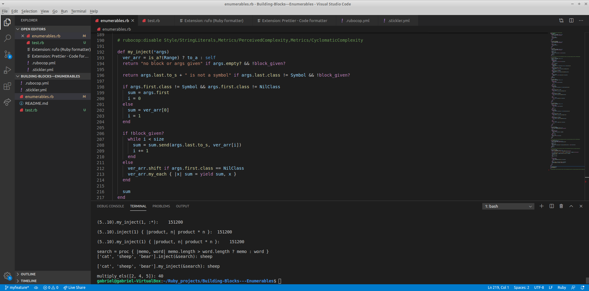

# Building-Blocks Enumerables
In this project, I have implemented my version of Ruby’s enumerable methods.
On file 'enumerables.rb' there are all methods and on file 'test.rb' I have prints calling those created methods along with the original one to compare



## Built With

- Ruby
- RSpec

## Live Demo

[Live Demo Link](https://repl.it/@gmalheiross/IdleWelcomeTelecommunications)

## Getting Started

You can get a local copy of the repository please run the following commands on your terminal:

```
$ cd <folder>

$ git clone https://github.com/Stricks1/Building-Blocks---Enumerables.git
```

To run the test file, go to your terminal on the folder you saved and type: ruby test.rb

## Testing with RSpec

To test it you should go to your terminal on the folder you saved and type: rspec

## Authors

👤 **Author**

Gabriel Malheiros Silveira

- Github: [@Stricks1](https://github.com/Stricks1)
- E-mail: [Gabriel Silveira](mailto:gmalheiross@gmail.com)
- Linkedin: [Gabriel Silveira](https://linkedin.com/in/gabriel-malheiros-silveira-b6632061/)

👤 **Author 2**

Rindra Josia

* Github: **[@rindrajosia](https://github.com/rindrajosia)**
* Twitter: **[@rindrajosia](https://twitter.com/josia_rindra)**
* Linkedin: **[linkedin](https://www.linkedin.com/in/rindra-josia-99b2111a2/)**

## 🤝 Contributing

Contributions, issues and feature requests are welcome!

Feel free to check the [issues page](issues/).

## Show your support

Give a ⭐️ if you like this project!

## Acknowledgments

 - Project from Microverse
 - Originally taken from The Odin Project
